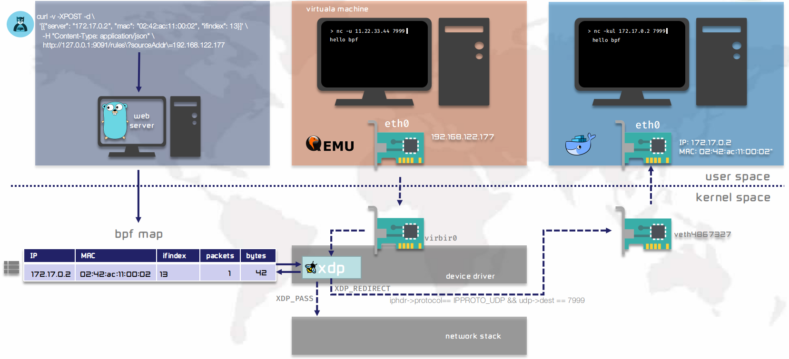

## xdp-redirect demo

An epbf program to demonstrate how the XDP redirect packets

## Prerequisites

### Prepare development environment

Need to prepare the eBPF development environment, you can refer the Cilium document of [BPF and XDP Reference Guide](https://docs.cilium.io/en/stable/bpf/#development-environment)

### Background

The program demonstrates the XDP redirects UDP packages to another network interface. The following diagram illustrates the background in which the demo was run.

